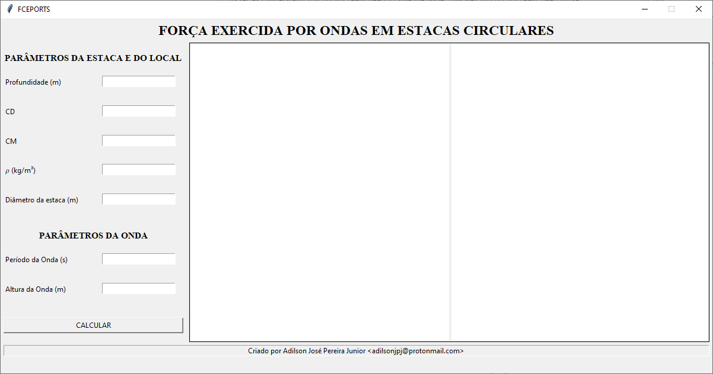
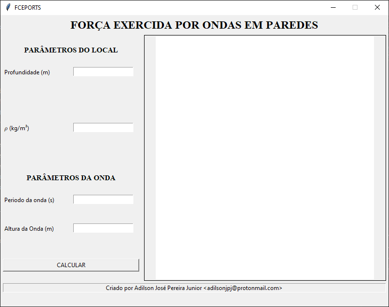

# FCEPORTS
 Ferramenta computacional para ajuda no cálculo e dimensionamento de estruturas portuárias.

## Ondas em Estacas
Para determinar as forças exercidas na estaca, aqui é feito o uso da fórmula de Morison.

## Ondas em Obstáculos
Para determinar as pressões causadas por uma onda do tipo *clapotis* em uma parede, aqui é feito o uso dos diagramas de Sainflou.

